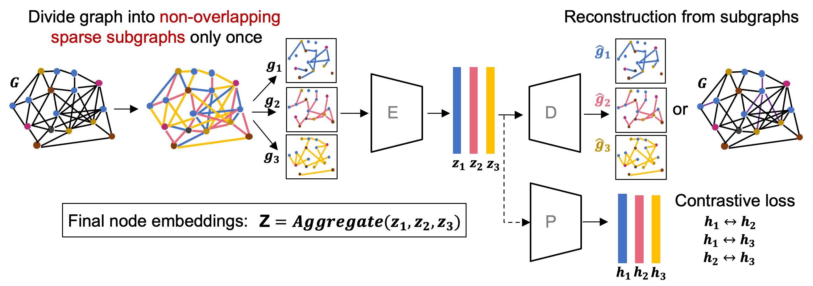

# NESS: 
##### Author: Talip Ucar (ucabtuc@gmail.com)


# Table of Contents:

1. [Model](#model)
2. [Datasets](#datasets)
3. [Environment](#environment)
4. [Configuration](#configuration)
5. [Training](#training)
6. [Results](#results)
7. [Citing this repo](#citing-this-repo)


# Model


# Datasets
Following datasets are supported:

1. cora
2. citeseer 
3. pubmed
4. texas
5. wisconsin
6. cornell
7. charmeleon

**Note:** Config file for Cora is provided. For others, you can copy Cora config file and change its name to the dataset of interest.

# Environment
It is tested with Python 3.9. You can set up the environment by following steps:

```
pip install pipenv             # To install pipenv if you don't have it already
pipenv install --skip-lock     # To install required packages. 
pipenv shell                   # To activate virtual env
```


# Configuration
A yaml config file for each dataset (e.g., cora.yaml) must be saved under the "./config/" directory. The name of these yaml files need to match to the name of the dataset.

# Training
You can train the model using any supported dataset. 
```
python train.py -d cora
```


# Results

Results at the end of training is saved under "./results" directory. Results directory structure:

<pre>
results
    |
  dataset name  (e.g. cora)      
        |-evaluation 
            |-reconstructions (not used)
            |-clusters (not used)
        |-training
            |-model  (where the models are saved)
            |-plots  (where the plots are saved as png files)
            |-loss   (where the summary of metrics is saved as csv file)
</pre>


# Citing this repo
If you use this work in your own studies, and work, you can cite it by using the following:

```
@Misc{talip_ucar_2023_NESS,
  author =   {Talip Ucar},
  title =    {{Pytorch implementation of NESS: Node Embeddings from Static Subgraphs}},
  howpublished = {\url{https://github.com/AstraZeneca/NESS}},
  month        = May,
  year = {since 2023}
}
```
